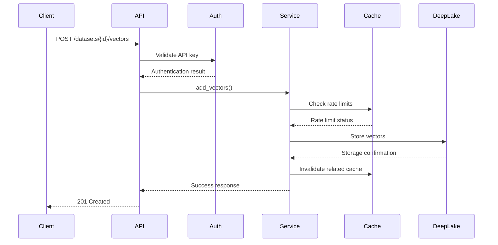
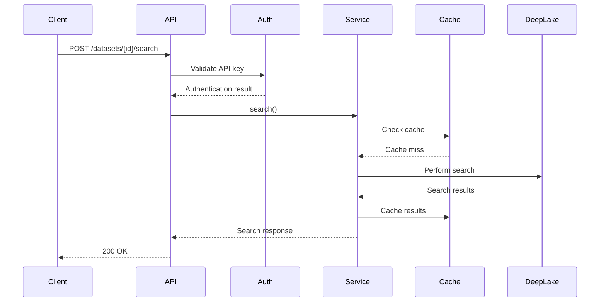

# Architecture Overview

This document provides a comprehensive overview of the Tributary AI Service for DeepLake architecture, including system design, component interactions, and architectural decisions.

## 🏗️ System Architecture

### High-Level Architecture

```
┌─────────────────────────────────────────────────────────────────────────────────┐
│                                External Clients                                 │
├─────────────────────────────────────────────────────────────────────────────────┤
│   Web Apps   │   Mobile Apps   │   Python SDK   │   JavaScript SDK   │   CLI    │
└─────────────────────────────────────────────────────────────────────────────────┘
                                        │
                                        ▼
┌─────────────────────────────────────────────────────────────────────────────────┐
│                                 Load Balancer                                   │
│                              (NGINX / HAProxy)                                  │
└─────────────────────────────────────────────────────────────────────────────────┘
                                        │
                                        ▼
┌─────────────────────────────────────────────────────────────────────────────────┐
│                              API Gateway Layer                                  │
├─────────────────────────────────────────────────────────────────────────────────┤
│  ┌─────────────────┐  ┌─────────────────┐  ┌─────────────────┐                │
│  │   HTTP API      │  │   gRPC API      │  │   Admin API     │                │
│  │                 │  │                 │  │                 │                │
│  │ • REST Endpoints│  │ • Streaming     │  │ • Health Checks │                │
│  │ • OpenAPI Spec  │  │ • Batch Ops     │  │ • Metrics       │                │
│  │ • Rate Limiting │  │ • High Perf     │  │ • Admin Panel   │                │
│  └─────────────────┘  └─────────────────┘  └─────────────────┘                │
└─────────────────────────────────────────────────────────────────────────────────┘
                                        │
                                        ▼
┌─────────────────────────────────────────────────────────────────────────────────┐
│                               Service Layer                                     │
├─────────────────────────────────────────────────────────────────────────────────┤
│  ┌─────────────────┐  ┌─────────────────┐  ┌─────────────────┐                │
│  │ DeepLake Service│  │ Search Service  │  │ Metadata Service│                │
│  │                 │  │                 │  │                 │                │
│  │ • Dataset Mgmt  │  │ • Vector Search │  │ • Filtering     │                │
│  │ • Vector Ops    │  │ • Hybrid Search │  │ • Schema Mgmt   │                │
│  │ • Batch Ops     │  │ • Text Search   │  │ • Validation    │                │
│  └─────────────────┘  └─────────────────┘  └─────────────────┘                │
│                                                                                 │
│  ┌─────────────────┐  ┌─────────────────┐  ┌─────────────────┐                │
│  │ Auth Service    │  │ Cache Service   │  │ Backup Service  │                │
│  │                 │  │                 │  │                 │                │
│  │ • Authentication│  │ • Query Cache   │  │ • Snapshots     │                │
│  │ • Authorization │  │ • Session Cache │  │ • Disaster Rec  │                │
│  │ • Rate Limiting │  │ • Metadata Cache│  │ • S3 Storage    │                │
│  └─────────────────┘  └─────────────────┘  └─────────────────┘                │
└─────────────────────────────────────────────────────────────────────────────────┘
                                        │
                                        ▼
┌─────────────────────────────────────────────────────────────────────────────────┐
│                               Data Layer                                        │
├─────────────────────────────────────────────────────────────────────────────────┤
│  ┌─────────────────┐  ┌─────────────────┐  ┌─────────────────┐                │
│  │ DeepLake Hub    │  │ Redis Cache     │  │ Local Storage   │                │
│  │                 │  │                 │  │                 │                │
│  │ • Vector Storage│  │ • Session Data  │  │ • Temp Files    │                │
│  │ • Metadata      │  │ • Query Cache   │  │ • Logs          │                │
│  │ • Versioning    │  │ • Rate Limits   │  │ • Configs       │                │
│  └─────────────────┘  └─────────────────┘  └─────────────────┘                │
└─────────────────────────────────────────────────────────────────────────────────┘
```

## 🔧 Component Architecture

### Core Components

#### 1. API Gateway Layer

**HTTP API Server**
- FastAPI-based REST API
- OpenAPI/Swagger documentation
- Request/response validation
- Error handling and logging
- CORS and security headers

**gRPC API Server**
- High-performance binary protocol
- Streaming support
- Connection pooling
- Load balancing
- Protocol buffer definitions

**Admin API**
- Health checks and monitoring
- Metrics collection
- Administrative operations
- System management

#### 2. Service Layer

**DeepLake Service**
```python
class DeepLakeService:
    """Core vector database operations"""
    
    async def create_dataset(self, dataset_id: str, config: DatasetConfig)
    async def add_vectors(self, dataset_id: str, vectors: List[List[float]], metadata: List[Dict])
    async def search(self, dataset_id: str, query_vector: List[float], k: int, filter: Dict)
    async def delete_vectors(self, dataset_id: str, vector_ids: List[str])
    async def get_dataset_info(self, dataset_id: str)
```

**Search Service**
```python
class SearchService:
    """Advanced search operations"""
    
    async def vector_search(self, dataset_id: str, query_vector: List[float], params: SearchParams)
    async def text_search(self, dataset_id: str, query: str, params: SearchParams)
    async def hybrid_search(self, dataset_id: str, query_vector: List[float], query_text: str, params: HybridSearchParams)
    async def multi_modal_search(self, dataset_id: str, inputs: Dict[str, Any])
```

**Metadata Service**
```python
class MetadataService:
    """Metadata management and filtering"""
    
    async def apply_filter(self, dataset_id: str, filter_query: Dict)
    async def validate_metadata(self, metadata: Dict, schema: Dict)
    async def extract_metadata(self, content: Any, extractors: List[str])
    async def update_schema(self, dataset_id: str, schema: Dict)
```

#### 3. Data Layer

**DeepLake Hub Integration**
- Vector storage and retrieval
- Metadata indexing
- Version control
- Distributed storage

**Redis Cache**
- Query result caching
- Session management
- Rate limiting data
- Temporary data storage

**Local Storage**
- Configuration files
- Temporary files
- Log files
- Backup metadata

## 🔄 Data Flow

### Vector Insert Flow



### Search Flow



## 🏛️ Architectural Patterns

### 1. Layered Architecture

**Presentation Layer**
- HTTP/gRPC APIs
- Request/response handling
- Authentication/authorization
- Input validation

**Business Logic Layer**
- Core services
- Business rules
- Workflow orchestration
- Data transformation

**Data Access Layer**
- Repository patterns
- Data mapping
- Connection management
- Caching strategies

**Infrastructure Layer**
- External service integration
- Monitoring and logging
- Configuration management
- Error handling

### 2. Microservices Architecture

**Service Decomposition**
- Single responsibility principle
- Loose coupling
- Independent deployment
- Technology diversity

**Communication Patterns**
- Synchronous: HTTP/gRPC
- Asynchronous: Message queues
- Event-driven: Pub/Sub
- Request/response: Direct calls

**Data Management**
- Database per service
- Shared data strategies
- Event sourcing
- CQRS (Command Query Responsibility Segregation)

### 3. Event-Driven Architecture

**Event Types**
- Domain events
- Integration events
- System events
- Business events

**Event Flow**
```python
class EventBus:
    """Event bus for decoupled communication"""
    
    async def publish(self, event: Event)
    async def subscribe(self, event_type: str, handler: Callable)
    async def unsubscribe(self, event_type: str, handler: Callable)
```

## 🔐 Security Architecture

### Authentication & Authorization

**Multi-layer Security**
```
┌─────────────────────────────────────────────────────────────────┐
│                    Security Layers                              │
├─────────────────────────────────────────────────────────────────┤
│  Layer 1: Network Security (TLS, VPN, Firewall)                │
│  Layer 2: API Gateway (Rate limiting, Input validation)        │
│  Layer 3: Authentication (API keys, JWT, OAuth)                │
│  Layer 4: Authorization (RBAC, Tenant isolation)               │
│  Layer 5: Data Security (Encryption, Access control)           │
└─────────────────────────────────────────────────────────────────┘
```

**Security Components**
- API Key Management
- JWT Token validation
- Role-based Access Control (RBAC)
- Tenant isolation
- Audit logging

### Data Protection

**Encryption**
- TLS 1.3 for data in transit
- AES-256 for data at rest
- Key management with HSM
- Certificate management

**Access Control**
- Principle of least privilege
- Resource-based permissions
- Time-based access
- IP-based restrictions

## 📊 Performance Architecture

### Scalability Strategies

**Horizontal Scaling**
- Load balancing
- Auto-scaling groups
- Container orchestration
- Database sharding

**Vertical Scaling**
- Resource optimization
- Memory management
- CPU optimization
- Storage optimization

**Caching Strategies**
```python
class CacheStrategy:
    """Multi-level caching architecture"""
    
    # L1: Application cache (in-memory)
    app_cache: Dict[str, Any]
    
    # L2: Distributed cache (Redis)
    redis_cache: RedisClient
    
    # L3: CDN cache (CloudFlare)
    cdn_cache: CDNClient
    
    async def get(self, key: str) -> Any:
        # Check L1 cache
        if key in self.app_cache:
            return self.app_cache[key]
        
        # Check L2 cache
        value = await self.redis_cache.get(key)
        if value:
            self.app_cache[key] = value
            return value
        
        # Check L3 cache / origin
        return await self.fetch_from_origin(key)
```

### Performance Optimizations

**Database Optimizations**
- Connection pooling
- Query optimization
- Index management
- Batch operations

**Network Optimizations**
- HTTP/2 and HTTP/3
- Connection keep-alive
- Compression (gzip, brotli)
- CDN integration

**Memory Optimizations**
- Object pooling
- Lazy loading
- Memory mapping
- Garbage collection tuning

## 🔍 Monitoring Architecture

### Observability Stack

**Metrics Collection**
- Prometheus for metrics
- Grafana for visualization
- Custom metrics
- Business metrics

**Logging**
- Structured logging
- Centralized logging
- Log aggregation
- Log analysis

**Tracing**
- Distributed tracing
- Request correlation
- Performance analysis
- Error tracking

### Monitoring Components

```python
class MonitoringService:
    """Centralized monitoring service"""
    
    def __init__(self):
        self.metrics = PrometheusMetrics()
        self.logger = StructuredLogger()
        self.tracer = OpenTelemetryTracer()
    
    async def record_request(self, request: Request, response: Response):
        # Record metrics
        self.metrics.http_requests_total.inc()
        self.metrics.http_request_duration.observe(response.processing_time)
        
        # Log request
        self.logger.info("Request processed", 
                        method=request.method,
                        path=request.path,
                        status_code=response.status_code)
        
        # Add to trace
        with self.tracer.start_span("http_request") as span:
            span.set_attribute("http.method", request.method)
            span.set_attribute("http.status_code", response.status_code)
```

## 🚀 Deployment Architecture

### Container Architecture

**Docker Containerization**
```dockerfile
# Multi-stage build
FROM python:3.11-slim as builder
WORKDIR /app
COPY requirements.txt .
RUN pip install --no-cache-dir -r requirements.txt

FROM python:3.11-slim
WORKDIR /app
COPY --from=builder /usr/local/lib/python3.11/site-packages /usr/local/lib/python3.11/site-packages
COPY . .
EXPOSE 8000
CMD ["uvicorn", "app.main:app", "--host", "0.0.0.0", "--port", "8000"]
```

**Kubernetes Deployment**
```yaml
apiVersion: apps/v1
kind: Deployment
metadata:
  name: deeplake-api
spec:
  replicas: 3
  selector:
    matchLabels:
      app: deeplake-api
  template:
    spec:
      containers:
      - name: api
        image: deeplake-api:latest
        ports:
        - containerPort: 8000
        env:
        - name: REDIS_URL
          value: "redis://redis:6379"
        resources:
          requests:
            memory: "512Mi"
            cpu: "250m"
          limits:
            memory: "2Gi"
            cpu: "1000m"
```

### Infrastructure as Code

**Terraform Configuration**
```hcl
resource "aws_ecs_cluster" "deeplake" {
  name = "deeplake-cluster"
}

resource "aws_ecs_service" "deeplake_api" {
  name            = "deeplake-api"
  cluster         = aws_ecs_cluster.deeplake.id
  task_definition = aws_ecs_task_definition.deeplake_api.arn
  desired_count   = 3
  
  load_balancer {
    target_group_arn = aws_lb_target_group.deeplake_api.arn
    container_name   = "deeplake-api"
    container_port   = 8000
  }
}
```

## 🔧 Configuration Management

### Configuration Architecture

**Configuration Sources**
1. Environment variables
2. Configuration files
3. Command line arguments
4. Remote configuration services
5. Default values

**Configuration Hierarchy**
```python
class ConfigurationManager:
    """Hierarchical configuration management"""
    
    def __init__(self):
        self.sources = [
            EnvironmentSource(),
            FileSource("config.yaml"),
            RemoteSource("consul://localhost:8500"),
            DefaultSource()
        ]
    
    def get(self, key: str, default=None):
        for source in self.sources:
            value = source.get(key)
            if value is not None:
                return value
        return default
```

### Environment Management

**Environment Separation**
- Development
- Testing
- Staging
- Production

**Configuration per Environment**
```yaml
# config/development.yaml
database:
  host: localhost
  port: 5432
  ssl: false

# config/production.yaml
database:
  host: prod-db.example.com
  port: 5432
  ssl: true
```

## 🔄 Integration Architecture

### External Service Integration

**Service Mesh**
- Istio for service communication
- Traffic management
- Security policies
- Observability

**API Gateway Integration**
- Kong/Ambassador
- Rate limiting
- Authentication
- Request routing

**Third-party Services**
- OpenAI API
- Embedding services
- Cloud storage
- Monitoring services

### Data Integration

**ETL Pipelines**
- Data extraction
- Data transformation
- Data loading
- Error handling

**Streaming Integration**
- Apache Kafka
- Real-time processing
- Event streaming
- Data pipelines

## 📈 Scalability Considerations

### Performance Bottlenecks

**Identification**
- Performance profiling
- Load testing
- Bottleneck analysis
- Resource monitoring

**Mitigation Strategies**
- Caching
- Load balancing
- Database optimization
- Code optimization

### Auto-scaling

**Metrics-based Scaling**
- CPU utilization
- Memory usage
- Request rate
- Queue depth

**Predictive Scaling**
- Historical patterns
- Machine learning
- Forecast demand
- Proactive scaling

## 🛡️ Reliability Architecture

### Fault Tolerance

**Circuit Breaker Pattern**
```python
class CircuitBreaker:
    """Circuit breaker for external service calls"""
    
    def __init__(self, failure_threshold=5, timeout=60):
        self.failure_threshold = failure_threshold
        self.timeout = timeout
        self.failure_count = 0
        self.last_failure_time = None
        self.state = "CLOSED"
    
    async def call(self, func, *args, **kwargs):
        if self.state == "OPEN":
            if time.time() - self.last_failure_time > self.timeout:
                self.state = "HALF_OPEN"
            else:
                raise CircuitBreakerOpenException()
        
        try:
            result = await func(*args, **kwargs)
            self.reset()
            return result
        except Exception as e:
            self.record_failure()
            raise e
```

**Retry Strategies**
- Exponential backoff
- Jitter
- Max retry attempts
- Circuit breaker integration

### High Availability

**Redundancy**
- Multiple instances
- Multiple availability zones
- Multiple regions
- Database replicas

**Health Checks**
- Deep health checks
- Dependency checks
- Load balancer integration
- Automated failover

## 🔍 Testing Architecture

### Testing Pyramid

**Unit Tests**
- Service logic tests
- Repository tests
- Utility function tests
- Mock dependencies

**Integration Tests**
- API endpoint tests
- Database integration tests
- External service tests
- Component interaction tests

**End-to-End Tests**
- User workflow tests
- Performance tests
- Load tests
- Security tests

### Test Infrastructure

**Test Environments**
- Local development
- CI/CD pipeline
- Staging environment
- Production monitoring

**Test Data Management**
- Test data creation
- Data cleanup
- Data anonymization
- Test isolation

## 🔗 Related Documentation

- [Deployment Guide](./deployment/)
- [Security Guide](./security.md)
- [Performance Guide](./performance.md)
- [Monitoring Guide](./monitoring.md)
- [Development Guide](./development/)

## 📞 Architecture Support

For architecture questions and discussions:
- **Architecture Team**: [architecture@yourcompany.com](mailto:architecture@yourcompany.com)
- **Technical Discussions**: [GitHub Discussions](https://github.com/your-org/deeplake-api/discussions)
- **Design Reviews**: [Internal Wiki](https://wiki.yourcompany.com/architecture)
- **Architecture Office Hours**: Fridays 2-4 PM EST